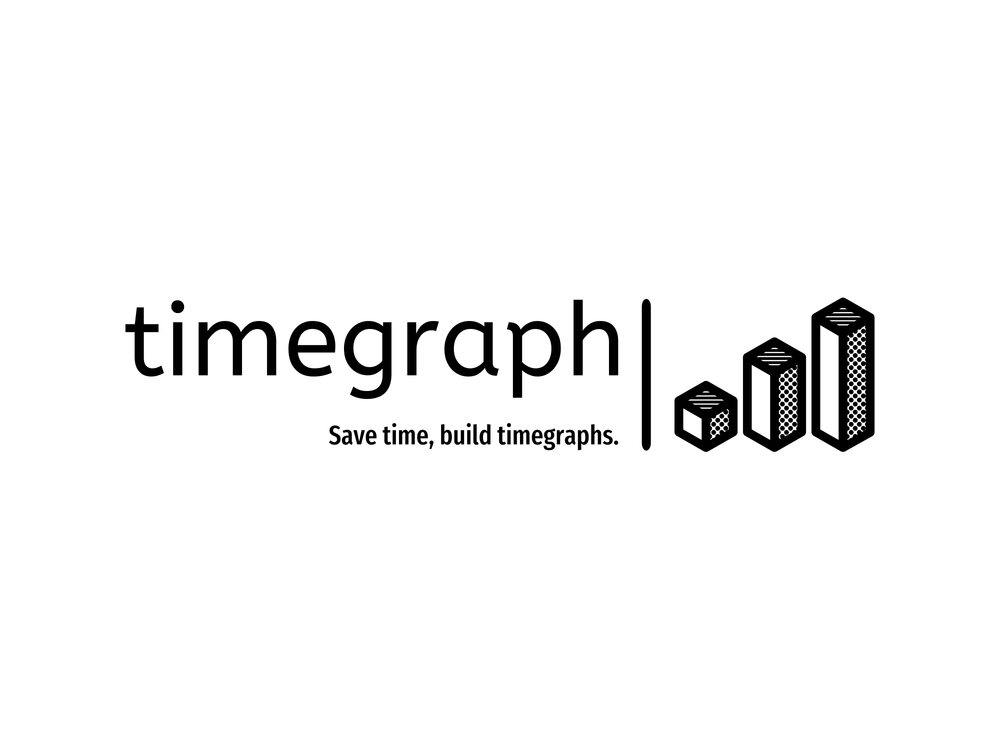

# Summarising timelines from your documents has never been easier.

      <a href="#key-features">Key Features</a> •
      <a href="#notes">Notes</a> •
      <a href="#future-development">Future Development</a>

## Key Features
* Upload your own documents and watch as the timeline auto-generates.
* Customise the start-end range and keywords to be searched. (coming soon!)
* Reference your document right from the timeline. (coming soon!)

## Notes
timegraph is currently a work in progress and we would love to hear your feedback (whether you're a buildclub judge or not!). We believe in building tools that automate menial workflows, so that users can better focus their time on more important, analytical tasks. Thus far, we have spoken to paralegals and academics on the problems they face with structuring a coherent timeline (ie. fact-finding) when presented with large documents. We would like to hear from you if you have any feedback on how we can expand our use cases, or introducing additional functionalities that you would love to see.
\- timegraph team

## Future Development
We are far from a finished product and here are some of the features that we intend to develop in the near future:

- [ ] Improve the UI and UX! Most definitely something to be worked on.
- [ ] Include support for a single timeline from multiple documents.
- [ ] Allow multiple document filetypes.
- [ ] Deploy local, on-prem solutions for entities with privacy/security concerns.
- [ ] Model fine-tuning with LoRA via unsloth for separate network heads per use case.